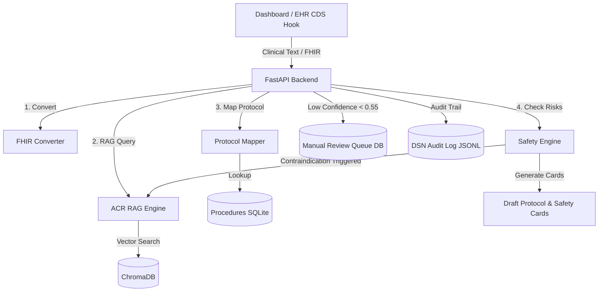

# ACR Appropriateness Criteria - Clinical Decision Support Hub (ACR-AC-RAG)

An enterprise-ready, FHIR-native, and CDS Hooks-compliant Retrieval-Augmented Generation (RAG) system designed to assist clinicians in ordering and performing the most appropriate imaging examinations based on the American College of Radiology (ACR) Appropriateness Criteria.

---

## 🌟 Key Features

*   **Clinical Presentation Parser (FHIR-Native):** Converts unstructured clinical text or inputs into standard HL7 FHIR Bundle resources (Patient, Condition, Observation, AllergyIntolerance, MedicationStatement).
*   **ACR Guideline RAG Engine:** Queries the ACR Appropriateness Criteria database using high-dimensional Google Gemini embeddings (`models/gemini-embedding-2`) and ChromaDB vector store.
*   **Protocoling Assistant:** Maps the recommended ACR exam to hospital-specific, localized scan protocols (e.g. contrast types, volumes, rates, phase sequences) using a custom mapping database.
*   **Safety Profile Evaluator:** Proactively flags potential scan risks based on clinical indicators:
    *   **eGFR** (Kidney function warnings for IV contrast agents)
    *   **Allergies** (Contrast allergy warnings)
    *   **Pregnancy status** (Radiation risk alerts)
    *   **Medication Holds** (e.g. Metformin hold rules)
*   **Closed-Loop Safety Re-Query:** Detects hard contraindications (such as pacemakers or severe contrast allergies) and automatically re-queries the RAG engine with safety constraints to suggest alternative, non-contrast or safer imaging modalities.
*   **Confidence Routing & Manual Review Queue:** Scenarios with low-confidence RAG matching scores (< 0.55) are automatically routed to a SQLite-based manual review queue database (`data/query_cache.db`), enabling senior radiologists to claim, review, and resolve complex clinical presentations.
*   **Decision Support Number (DSN) Audit Trail:** Generates a tamper-evident, unique transaction identifier (`ACR-[DATE]-[HASH]`) for every clinical decision, logging the transaction to an immutable audit file (`data/logs/dsn_audit_log.jsonl`) for compliance verification.
*   **Conversational Attending Radiology Co-Pilot:** An interactive, conversational LLM assistant chat drawer (`/v1/copilot/chat`) to discuss case presentations and clarify guidelines recommendations.
*   **Clinical Overrides & Audit Log:** Enables clinicians to manually override guideline recommendations by logging justifications to `/v1/override` for compliance auditing.
*   **CDS Hooks Compliant:** Implements a `/v1/cds-hook` endpoint (e.g. `order-select`) for integration directly with Electronic Health Record (EHR) platforms.
*   **Premium CDS Dashboard:** A beautiful, fully mobile-responsive single-page web dashboard (`index.html`) served directly by the FastAPI backend for clinical simulation on desktop, tablet, and phone viewports.

---

## 🏗 System Architecture



---

## 🚀 Tech Stack

*   **Core API Framework:** FastAPI (Python 3.11) & Uvicorn
*   **LLM & Embeddings:** Google Gemini (`gemini-2.5-flash`), `google-genai`
*   **Vector Database:** ChromaDB
*   **Data Store:** SQLite (for local caching and clinical protocol procedures mapping)
*   **Static UI Frontend:** Vanilla HTML5, CSS3, & Modern Javascript (Desktop & mobile-optimized layouts, horizontal swipeable tabs with auto-centering, stacked mobile-friendly rating cards, full-bleed co-pilot drawer, auto-scrolling to results, Dark Mode, and micro-animations)
*   **Cloud Hosting:** Google Cloud Run, Google Cloud Storage (GCS)
*   **CI/CD:** GitHub Actions

---

## 🛠 Local Setup & Development

### Prerequisites
*   Python 3.11+
*   Google Cloud Platform (GCP) API Key (with Gemini Access)

### Installation
1.  **Clone the repository:**
    ```bash
    git clone https://github.com/your-username/acr-ac-rag.git
    cd acr-ac-rag
    ```

2.  **Create and activate a virtual environment:**
    ```bash
    python -m venv .venv
    # Windows:
    .\.venv\Scripts\activate
    # macOS/Linux:
    source .venv/bin/activate
    ```

3.  **Install dependencies:**
    ```bash
    pip install -r requirements.txt
    ```

4.  **Set up environment variables:**
    Create a `.env` file in the root directory:
    ```env
    GOOGLE_API_KEY="your-gemini-api-key-here"
    EMBEDDING_MODE="gemini"
    ```

### Run the App Locally
Run the Uvicorn server with hot reloading enabled:
```bash
python -m uvicorn main:app --reload
```
Open **`http://localhost:8000`** in your browser to access the Clinical Decision Support Hub Dashboard.

---

## 💾 Ingestion & Data Management

If you need to update the vector database with new PDF guidelines or structured procedures:

1.  Place new guideline PDFs in `data/pdf_narratives/` and update your structured mappings in `data/acr_variant_tables.json`.
2.  Run the local ingestion pipeline to rebuild the database:
    ```bash
    python ingest.py
    ```
3.  Upload the updated database files directly to your Cloud Storage bucket (where it is instantly mounted in Cloud Run without code redeploys):
    ```bash
    gcloud storage cp -r chroma_db_gemini gs://your-bucket-name/chroma_db_gemini
    gcloud storage cp data/acr_procedures.db gs://your-bucket-name/data/acr_procedures.db
    ```

---

## ☁ Cloud Deployment & CI/CD

This repository includes a fully automated **GitHub Actions** deployment pipeline.

*   **Workflow file:** `.github/workflows/deploy.yml`
*   **Trigger:** Commits pushed to the `main` branch.
*   **Target:** Deploys containerized code directly to **Google Cloud Run** in `us-east1`.
*   **Database Externalization:** Uses **Cloud Storage FUSE** to mount a GCS bucket onto the Cloud Run revision at `/mnt/gcs`, which is copied to local container memory (`/tmp`) on startup for optimal RAM-speed lookups.

### Secrets Configuration
To enable CI/CD, add the following secrets under **Settings** -> **Secrets and variables** -> **Actions** in your GitHub repository:
*   `GCP_PROJECT_ID`: Your Google Cloud Project ID (e.g. `acr-ac-rag`).
*   `GCP_SA_KEY`: The JSON credentials key for your GCP Service Account.
