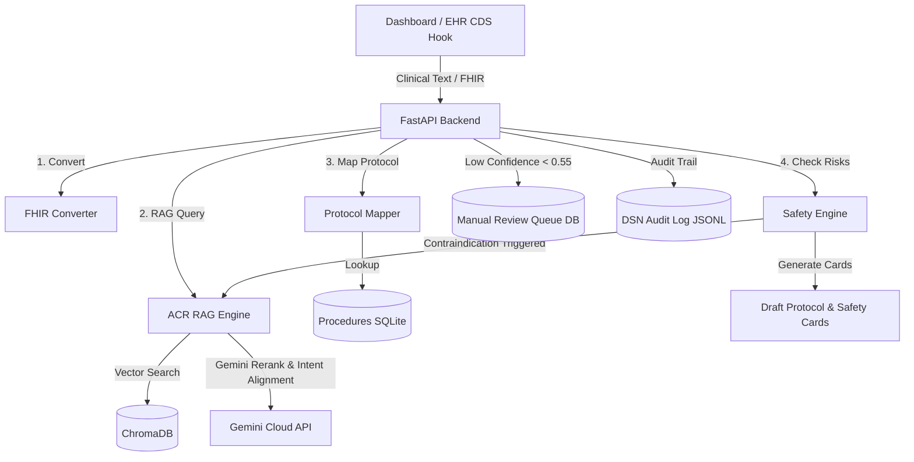

# ACR Appropriateness Criteria - Clinical Decision Support Hub (ACR-AC-RAG)

An enterprise-grade, FHIR-native, and CDS Hooks-compliant Clinical Decision Support (CDS) system. It combines Retrieval-Augmented Generation (RAG) with clinical heuristics and safety guardrails to assist clinicians in ordering appropriate imaging examinations and interventional procedures, grounded directly in the published **American College of Radiology (ACR) Appropriateness Criteria**.

---

## 🌟 Core Capabilities & What it Accomplishes

*   **Clinical Presentation Parser (FHIR-Native):** Converts unstructured clinical text (e.g., from a search box or clinic note) into standard HL7 FHIR Bundle resources (`Patient`, `Condition`, `Observation`, `AllergyIntolerance`, `MedicationStatement`) using structured Gemini-driven entity extraction.
*   **ACR Guideline RAG Engine:** Indexes and queries 275 ACR Appropriateness Criteria PDF narrative guidelines and variant tables using high-dimensional Google Gemini embeddings (`models/gemini-embedding-2`), a ChromaDB vector store, and a BM25 lexical retriever in a hybrid configuration.
*   **Safety Profile Evaluator & Rules Engine:** Scans clinical indicators extracted from FHIR to alert providers of critical risks:
    *   **eGFR/Renal Alert:** Flags kidney function status (eGFR thresholds) for intravenous (IV) iodinated or gadolinium-based contrast agents.
    *   **Allergy Warnings:** Flags contrast agent class and brand allergies (e.g., Omnipaque, Visipaque, Isovue, gadolinium, iodine) mapped to RxNorm/SNOMED codes.
    *   **Radiation Safety (Pregnancy):** Displays warning banners for childbearing/pregnant patients when ordering ionizing radiation procedures (CT, X-Ray).
    *   **Medication Safety:** Displays hold instructions for drugs like Metformin before/after IV contrast administration.
    *   **Interventional Radiology (IR) Holds:** Provides exact pre-procedure hold and post-procedure resume intervals for anticoagulants (e.g., Warfarin, Eliquis, Plavix) and evaluates lab values (platelets, INR) against safe interventional thresholds.
*   **Closed-Loop Safety Re-Query:** If a severe contraindication is detected (e.g., pacemakers for MRI or severe contrast anaphylaxis for CT), the engine automatically runs a secondary, constrained query to suggest safer, alternative modalities (e.g., Ultrasound, non-contrast CT/MRI).
*   **Protocoling Assistant (Local Procedures DB):** Maps recommended ACR procedures to localized hospital-specific scan protocols (e.g., contrast types, volumes, rates, phase sequences) via a SQLite mapping database (`data/acr_procedures.db`).
*   **Confidence Routing & Review Queue:** Queries scoring below the ambiguity threshold (< 0.55) are routed to a SQLite-based manual review queue database (`data/query_cache.db`), enabling senior radiologists to review, audit, and override complex presentations.
*   **Decision Support Number (DSN) Audit Trail:** Generates a unique, tamper-evident transaction identifier (`ACR-[DATE]-[HASH]`) logging recommendations, sources, and confidence scores to an immutable audit file (`data/logs/dsn_audit_log.jsonl`) for compliance verification.
*   **Clinician Overrides & Override Auditing:** Allows clinicians to manually override guideline recommendations by logging justifications (reason and clinical notes) to a secure SQLite override database.
*   **CDS Hooks Compliant:** Implements a `/v1/cds-hook` endpoint (e.g., `order-select`) for direct Electronic Health Record (EHR) integrations.
*   **Attending Co-Pilot Chat:** Provides an interactive clinical assistant conversational drawer built on top of the RAG pipeline, offering dialogue sessions with the "Attending Radiologist" using sanitized context.
*   **Web Dashboard:** A high-end, responsive dark-mode single-page dashboard (`index.html`) served directly by the FastAPI backend for clinical simulation on desktop, tablet, and phone viewports.

---

## 🏗 System Architecture



---

## ⚡ Performance, Scaling & Cost Optimizations

This system is optimized for serverless deployment on **Google Cloud Run** to ensure near-zero cold starts, high concurrency scaling, and minimal billing:

1.  **☁️ Cloud Gemini Reranker**: Replaced CPU-bound local Cross-Encoder models (`sentence-transformers`/`torch` which required 25-second startup load times) with a cloud-based **Gemini Cloud Reranker** (`ENABLE_LLM_RERANK="true"`). It offloads semantic comparison to the Gemini 2.5 Flash API at a cost of less than `1/100th of a cent` per search, reducing cold starts from **45 seconds to under 5 seconds**.
2.  **🎯 Clinical Intent Alignment (Procedural Boosting)**: Classifies user queries as Therapeutic (keywords: *treat, therapy, management, fix, embolization, ligation*) vs. Diagnostic (keywords: *image, scan, order, CT, MRI*). Appends SQLite candidate procedures to the reranker and applies a `+1.0` score boost to candidates matching the query's clinical intent. This guarantees accurate routing for interventional radiology guidelines (e.g., Thoracic Duct Embolization) vs. diagnostic scans.
3.  **🎯 Demographic Age-Based Pre-Filtering**: Detects patient age demographics (pediatric vs. adult) and pre-filters/prioritizes candidates (e.g., filtering out `Suspected Spine Trauma-Child` for adult queries) to prevent incorrect criteria mixing.
4.  **📖 Local Abbreviation & Acronym Expansion**: Maps common clinical shorthand (e.g. `LBP` -> `low back pain`, `PE` -> `pulmonary embolism`, `DVT` -> `deep vein thrombosis`) locally before querying, bridging the semantic gap for **zero token cost**.
5.  **🛡️ Fuzzy Anatomical Fallback (Abstention Gate)**: Extracted all known guideline topics to bypass the anatomical region check when the query matches a specific clinical guideline topic (e.g. `chylothorax`), resolving false-positive abstention query blocks.
6.  **🔄 Self-Healing Procedures Database**: Automated `init_procedures_db()` to check row counts against the source `data/acr_variant_tables.json` on startup. If a mismatch is detected, it drops and rebuilds the SQLite table to sync newly scraped guidelines.
7.  **⚡ Lightweight Container Footprint**: Deactivated heavy PyTorch/Transformers dependencies. This shrunk the Docker image footprint by **over 1.5 GB**, allowing Cloud Run to scale out and boot container instances instantly under load.
8.  **⚡ Async Thread Offloading**: Offloads blocking synchronous RAG and database tasks using `asyncio.to_thread` to keep the FastAPI event loop fully non-blocking.
9.  **🛡️ API Rate Limiting & Tenacity Retries**: Implemented client rate-limiting (`slowapi`, 30 req/min) on critical endpoints and exponential backoff retry policies (`tenacity`) on Google API calls to mitigate transient errors.
10. **💾 SQLite Query Cache & TTL**: Enforces a strict 7-day TTL cache expiration on query results inside the SQLite database, with automatic cloud GCS bucket synchronization.

---

## 📂 Project Directory Structure

Here is a map of the key files in the repository:

| File / Folder | Role & Functionality |
| :--- | :--- |
| **`main.py`** | Entry point hosting the FastAPI web application, HTTP middlewares, rate limiting, and all API endpoints (analysis, protocoling, override logger, review queue, attending chat, and CDS Hooks). |
| **`fhir_converter.py`** | Transforms unstructured clinical query strings into HL7 FHIR bundles containing `Patient`, `Condition`, `Observation`, `AllergyIntolerance`, and `MedicationStatement` resources using Gemini-driven entity extraction. |
| **`rag_engine.py`** | Handles vector database operations, hybrid BM25 search, Gemini-based cloud reranking, query abbreviation expansion, demographic age-based filtering, clinical intent classification, and closed-loop alternative routing. |
| **`safety_engine.py`** | Scans clinical indicators extracted from FHIR to evaluate iodine/gadolinium contrast contraindications (eGFR, allergy history), fetal radiation risks, and interventional cardiology/radiology threshold criteria (platelets, INR, medication hold guidelines). |
| **`protocol_mapper.py`** | Maps abstract ACR-recommended imaging procedures to localized scan protocols and parameters (e.g., contrast parameters, sequence instructions). |
| **`protocol_db.py`** | Connects to and queries the local SQL database to manage localized procedures and overrides. |
| **`copilot_engine.py`** | Powering the conversational Attending Chat drawer using context-injected dialogue sessions, matching patient clinical history with retrieved guidelines. |
| **`medical_ontology.py`** | Pre-defined static medical codes (LOINC, RxNorm, SNOMED-CT) mapping common medications, contrast types, and lab metrics for safety evaluation. |
| **`llm_router.py`** | Evaluates and routes query types based on semantic classification. |
| **`security_utils.py`** | Safeguards clinical text parsing against prompt-injection patterns. |
| **`ingest.py`** | Parses 275 ACR guideline PDFs and structured JSON variant tables, generating vector embeddings cached in a SQLite table. |
| **`index.html`** | Fully responsive, glassmorphic dark-mode clinician dashboard simulating the EHR workspace, attending chat, review queue, audit logs, and scan orders. |
| **`Dockerfile`** | Container specification optimized for Cloud Run serverless hosting (multi-stage build, minimal footprint). |
| **`requirements.txt`** | Dependency manifest specifying precise library pins. |
| **`data/`** | Location of SQLite DBs (`acr_procedures.db`, `query_cache.db`), raw guidelines, and audit logs. |

---

## 🚀 Tech Stack

*   **Core Framework:** FastAPI & Uvicorn (Python 3.11)
*   **Vector Database:** ChromaDB
*   **LLM & Embeddings:** Google Gemini (`gemini-2.5-flash`), `google-genai` SDK
*   **Metadata Storage:** SQLite (For caching, clinician overrides, and procedures mapping)
*   **Static UI:** Vanilla HTML5, CSS3, & Modern Javascript (Responsive dark-mode interface, swipeable tabs, override modal, and conversational attending chat drawer)
*   **Cloud Hosting:** Google Cloud Run, Google Cloud Storage (GCS)
*   **CI/CD:** GitHub Actions

---

## 🛠 Local Setup & Development

### Prerequisites
*   Python 3.11+
*   Google Cloud Platform (GCP) API Key (with Gemini Access)

### Installation
1.  **Clone the repository:**
    ```bash
    git clone https://github.com/khongp/acr-ac-rag.git
    cd acr-ac-rag
    ```
2.  **Create and activate a virtual environment:**
    ```bash
    python -m venv .venv
    # Windows:
    .\.venv\Scripts\activate
    # macOS/Linux:
    source .venv/bin/activate
    ```
3.  **Install dependencies:**
    ```bash
    pip install -r requirements.txt
    ```
4.  **Set up environment variables:**
    Create a `.env` file in the root directory:
    ```env
    GOOGLE_API_KEY="your-gemini-api-key-here"
    EMBEDDING_MODE="gemini"
    BYPASS_FHIR_LLM="false"
    ENABLE_LLM_RERANK="true"
    DISABLE_COPILOT="false"
    ```

### Run the App Locally
Run the Uvicorn server with hot reloading enabled:
```bash
python -m uvicorn main:app --reload
```
Open **`http://localhost:8000`** in your browser to access the Clinical Decision Support Hub Dashboard.

---

## 💾 Ingestion & Data Management

If you need to update the vector database with new PDF guidelines or structured procedures:

1.  Place new guideline PDFs in `data/pdf_narratives/` and update your structured mappings in `data/acr_variant_tables.json`.
2.  Run the local ingestion pipeline to rebuild the database:
    ```bash
    python ingest.py
    ```
3.  Upload the updated database files directly to your Cloud Storage bucket (where it is instantly mounted in Cloud Run without code redeploys):
    ```bash
    gsutil cp -r chroma_db_gemini gs://acr-ac-rag-data-667793722294/chroma_db_gemini
    gsutil cp data/acr_procedures.db gs://acr-ac-rag-data-667793722294/data/acr_procedures.db
    ```

---

## ☁ Cloud Deployment & CI/CD

This repository includes a fully automated **GitHub Actions** deployment pipeline.

*   **Workflow file:** `.github/workflows/deploy.yml`
*   **Trigger:** Commits pushed to the `main` branch.
*   **Target:** Deploys containerized code directly to **Google Cloud Run** in `us-east1`.
*   **Database Externalization:** Uses **Cloud Storage FUSE** to mount a GCS bucket onto the Cloud Run revision at `/mnt/gcs`. Database files are copied to local container memory (`/tmp`) on startup for optimal RAM-speed lookups.

### Secrets Configuration
To enable CI/CD, add the following secrets under **Settings** -> **Secrets and variables** -> **Actions** in your GitHub repository:
*   `GCP_PROJECT_ID`: Your Google Cloud Project ID.
*   `GCP_SA_KEY`: The JSON credentials key for your GCP Service Account.

---

## 🧪 Verification & Testing

Verify system integrity using the included offline and endpoint testing suite:

```bash
# Run all tests
pytest

# Run safety evaluation test cases specifically
pytest test_safety_security.py

# Run end-to-end integration and routing tests
pytest test_all_upgrades.py
```
