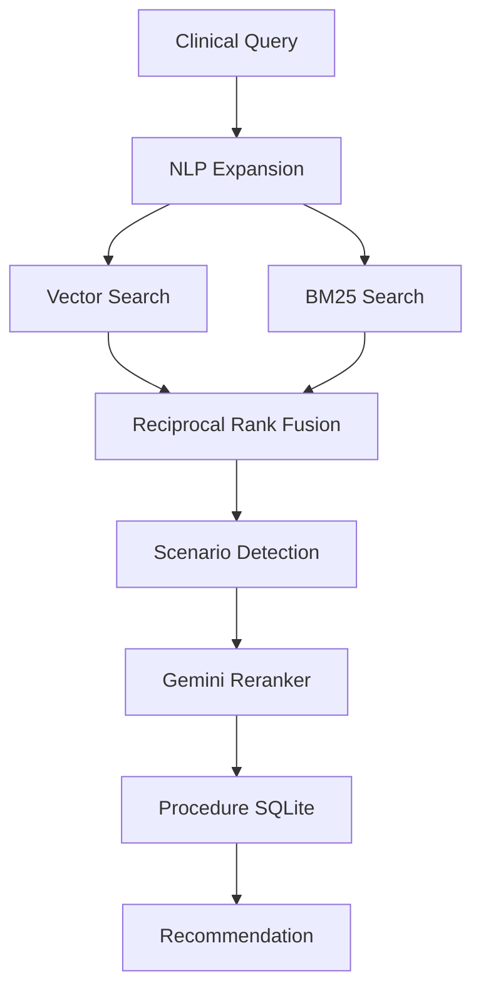
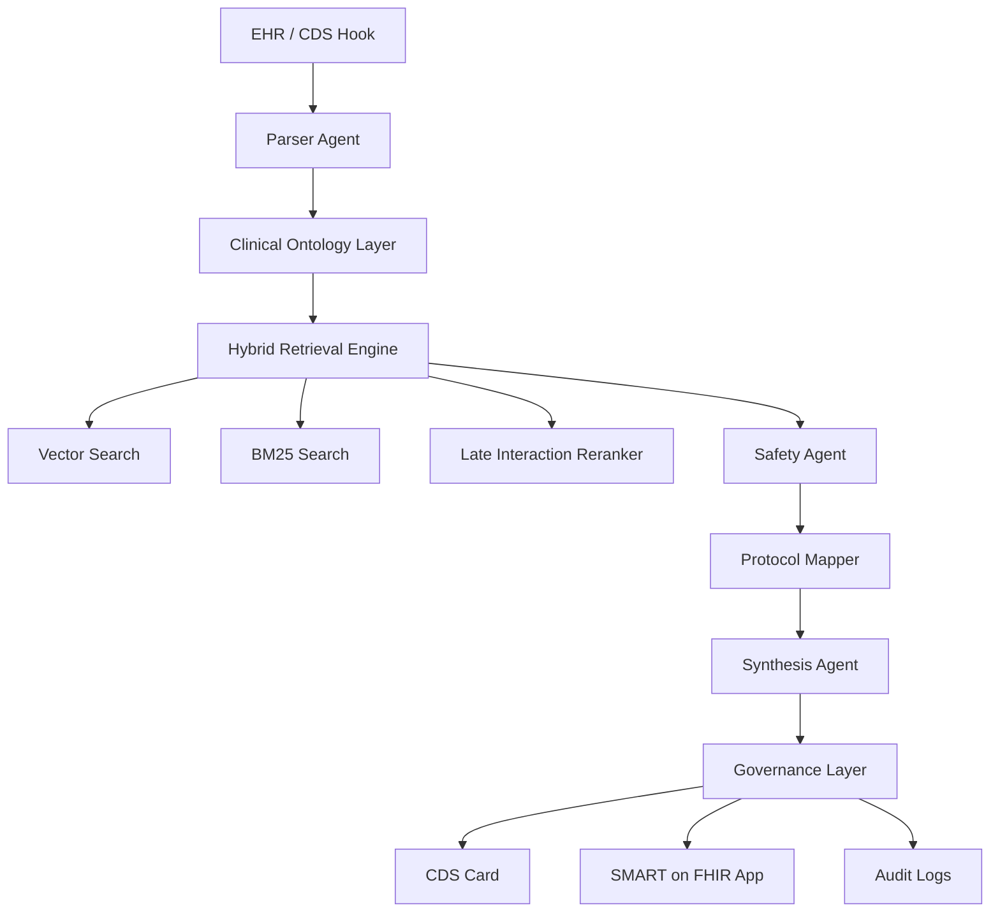

# ACR-AC-RAG Enterprise Platform Roadmap & Technical Architecture

## Project Overview

### Vision
Build a clinically trusted, enterprise-grade, AI-native radiology Clinical Decision Support (CDS) and imaging protocoling platform that:

- Interprets unstructured clinical narratives
- Maps requests to ACR Appropriateness Criteria (ACR-AC)
- Generates localized imaging protocol recommendations
- Performs real-time patient safety validation
- Integrates directly into EHR workflows
- Supports both cloud and on-prem deployment
- Achieves future qCDSM certification readiness

This platform should evolve beyond a simple RAG chatbot into a:

- Radiology workflow orchestration engine
- Imaging protocol intelligence layer
- Clinical reasoning infrastructure platform
- Longitudinal imaging governance system

---

# Current System Assessment

## Existing Strengths (Already Better Than Many Academic Systems)

Your current architecture already contains multiple enterprise-grade capabilities that are absent from most academic prototypes.

### Current Strengths

#### 1. CDS Hooks Native Integration

Current endpoint:

```http
POST /v1/cds-hook
```

Advantages:

- EHR-compatible workflow triggering
- Native order-entry integration
- Real-time clinical decision support
- SMART on FHIR extensibility path

Compared to research systems:

| System | Native CDS Integration |
|---|---|
| accGPT | ❌ |
| ped-Llama | ❌ |
| MSK Protocoling LLM | ❌ |
| Your Platform | ✅ |

---

#### 2. Advanced Safety Engine

Your `safety_engine.py` architecture is a major differentiator.

Current capabilities:

- eGFR evaluation
- Contrast contraindication checks
- Pregnancy safety logic
- Metformin hold logic
- Renal-adjusted medication guidance
- Contrast allergy checks

This is extremely important because:

Most academic systems optimize ONLY recommendation accuracy.

Hospitals care more about:

- Patient safety
- Legal defensibility
- Workflow interruption reduction
- Operational reliability

This becomes a major commercial moat.

---

#### 3. Local Protocol Mapping

Your:

```python
protocol_mapper.py
```

is strategically important.

Why this matters:

ACR guidelines are generic.

Hospitals operate using:

- Scanner-specific protocols
- Vendor-specific sequences
- Institution-specific naming conventions
- Department-specific contrast workflows

Most academic systems stop at:

"MRI Lumbar Spine recommended"

Your system can evolve into:

"MRI Lumbar Spine w/wo contrast using Hospital Protocol MSK-342 with metal suppression sequence"

That is a massive operational difference.

---

#### 4. Hybrid Retrieval Already Exists

Your current `rag_engine.py` already implements:

- Chroma vector search
- BM25 retrieval
- Reciprocal Rank Fusion (RRF)
- Candidate reranking
- Structured procedure retrieval
- Narrative retrieval
- SQLite-backed procedure tables

This is substantially more advanced than most academic proofs-of-concept.

---

# Existing Technical Architecture Analysis

## Current Retrieval Pipeline

Current architecture:



This is already stronger than:

- naive RAG
- pure vector search
- embedding-only pipelines
- single-stage retrieval systems

---

# Major Technical Gaps

## 1. No True Ontological Parsing

Current limitation:

Your system primarily performs semantic retrieval.

Missing:

- SNOMED normalization
- ICD-10 mapping
- LOINC integration
- Negation resolution
- Temporal reasoning
- Anatomical ontology mapping
- Symptom hierarchy resolution

### Why This Matters

Clinical text contains:

```text
"No evidence of acute trauma but progressive weakness and saddle anesthesia"
```

Simple embedding retrieval may fail to identify:

- cauda equina syndrome
- emergent spine compression
- neurologic red flags

Need:

```text
Unstructured Text
→ Clinical Entity Extraction
→ Ontology Normalization
→ Structured Clinical Graph
→ Retrieval
```

---

## 2. No Abstention Logic

Current limitation:

The system attempts recommendations even with incomplete information.

Dangerous examples:

```text
"Right hip pain"
```

Missing:

- trauma status
- chronicity
- fever
- infection suspicion
- cancer history
- neurologic symptoms

Enterprise systems MUST support:

- uncertainty detection
- clarification requests
- abstention routing
- escalation workflows

---

## 3. Cloud-Only Inference

Current limitation:

```python
Google Gemini APIs
```

Enterprise concerns:

- PHI governance
- hospital legal review
- latency
- internet dependency
- cloud approval delays
- security audits

Need:

- local deployment mode
- hybrid deployment mode
- offline capability
- edge inference

---

## 4. No Longitudinal Learning Layer

Missing:

- override analytics
- clinician acceptance tracking
- protocol outcome analysis
- continuous improvement loops
- self-learning mapping refinement

This is one of the biggest long-term moat opportunities.

---

# Competitive Landscape Analysis

# 1. accGPT (Rau et al. 2023)

## Architecture

- GPT-3.5-Turbo
- LlamaIndex
- ACR guideline indexing
- Basic vector retrieval

## Strengths

- Strong retrieval grounding
- Better than generic GPT prompting
- High consistency
- Reduced radiologist search burden

## Weaknesses

- Single-vector retrieval only
- Weak multi-hop reasoning
- No safety engine
- No EHR integration
- No protocol mapping
- No abstention
- No local deployment

## Commercial Weakness

It behaves like:

```text
AI Search Tool
```

rather than:

```text
Enterprise Clinical Workflow Infrastructure
```

---

# 2. ped-Llama

## Architecture

- Local Llama-3.1-8B
- Pediatric-specific RAG
- On-prem deployment

## Strengths

- Excellent PHI posture
- Pediatric specialization
- Local deployment
- Lower latency

## Weaknesses

- Smaller reasoning model
- GPU dependency
- Narrow clinical scope
- Prompt sensitivity
- Difficult infrastructure scaling

## Strategic Insight

The key innovation is NOT the model.

It is:

```text
Specialized clinical deployment architecture
```

This validates:

- hospital demand for local inference
- specialized radiology copilots
- narrow-domain optimization

---

# 3. MSK MRI Protocoling LLM

## Strengths

- Real operational value
- Reduced repeat scans
- Improved protocol quality
- Helps junior staff

## Weaknesses

- Not automated
- Prompt-driven workflows
- No orchestration layer
- No EHR integration

## Important Takeaway

Protocoling is a MUCH larger commercial opportunity than guideline retrieval alone.

Hospitals lose enormous money from:

- repeat MRI scans
- incorrect sequences
- contrast mis-selection
- wrong field-of-view
- missed metal suppression

Your protocol mapper could evolve into:

```text
AI Imaging Protocol Orchestrator
```

This is strategically huge.

---

# 4. Multi-Agent ColBERT RAG

## Strengths

- Best retrieval architecture
- Strong lexical precision
- Better reasoning separation
- High recall

## Weaknesses

- High latency
- Complex orchestration
- Expensive inference
- Hard ED throughput scaling

## Important Insight

You should NOT copy full multi-agent complexity initially.

Instead:

Use:

- lightweight agent orchestration
- late-interaction reranking
- structured parsing
- confidence gating

Avoid:

- deep recursive agent loops
- multi-provider orchestration chaos
- chain explosion

---

# 5. CareSelect Imaging

## Current Incumbent

### Strengths

- Regulatory acceptance
- EHR penetration
- PAMA compliance
- Billing support

### Weaknesses

- Terrible UX
- Alert fatigue
- Static rules
- Structured dropdown dependency
- No narrative parsing
- No adaptive intelligence
- No local protocoling
- No patient-context reasoning

## This Is Your Biggest Opportunity

CareSelect is:

```text
Rules Engine Software
```

You can become:

```text
Clinical Imaging Intelligence Infrastructure
```

---

# Strategic Product Positioning

## What Your Product Should Become

NOT:

```text
An AI chatbot for radiology
```

Instead:

```text
The operating system for intelligent imaging workflow orchestration
```

---

# Core Product Differentiators

## 1. Safety-First AI

Most AI radiology tools optimize:

- retrieval accuracy
- recommendation accuracy

You should optimize:

- safety governance
- explainability
- operational trust
- auditability

This matters far more commercially.

---

## 2. Localized Protocol Intelligence

This is your strongest differentiator.

Potential architecture:

```text
ACR Recommendation
→ Local Scanner Mapping
→ Sequence Optimization
→ Contrast Logic
→ Scheduling Logic
→ Safety Validation
→ Final Protocol
```

This creates:

- operational lock-in
- local institutional dependency
- high switching costs

---

## 3. Explainability Layer

Enterprise clinicians do NOT trust black-box AI.

Need:

- evidence highlighting
- source traceability
- rationale chains
- confidence scores
- guideline citations
- uncertainty indicators

---

# Recommended Enterprise Architecture



---

# 12-Month Technical Roadmap

# PHASE I — Ontological Rigor & Structured Retrieval (Months 1–3)

## Goal

Transform the current retrieval engine into a clinically structured reasoning pipeline.

---

## PRIORITY 1 — Clinical Entity Parser

### Build

Parser agent capable of:

- negation detection
- symptom extraction
- anatomical extraction
- chronicity extraction
- red flag detection
- temporal relationship detection

### Technologies

Recommended:

- medSpaCy
- scispaCy
- BioClinicalBERT
- SNOMED mappings
- QuickUMLS

### Example

Input:

```text
Progressive low back pain with saddle anesthesia and urinary retention.
```

Output:

```json
{
  "symptoms": [
    "low back pain",
    "saddle anesthesia",
    "urinary retention"
  ],
  "red_flags": [
    "cauda equina syndrome"
  ],
  "urgency": "emergent"
}
```

---

## PRIORITY 2 — ColBERT Re-ranking

Current retrieval:

```python
Vector + BM25 + RRF
```

Upgrade:

```text
Hybrid Retrieval
→ ColBERT Re-ranker
→ Structured Scenario Selection
```

Recommended:

- ModernBERT-ColBERT
- ColBERTv2
- Jina rerankers

Goal:

Improve:

- lexical divergence handling
- narrative matching
- symptom specificity
- uncommon phrasing retrieval

---

## PRIORITY 3 — Structured Confidence Layer

Every recommendation should produce:

```json
{
  "confidence": 0.93,
  "evidence_quality": "Strong",
  "retrieval_agreement": 0.88,
  "abstention_risk": 0.04
}
```

---

# PHASE II — Safety Governance & Enterprise Deployment (Months 4–6)

# PRIORITY 1 — Negative Rejection Engine

Critical feature.

The model must identify insufficient information.

Example:

```text
Right hip pain
```

Response:

```text
Additional clinical details required:
- trauma?
- infection concern?
- fever?
- inability to bear weight?
- malignancy history?
```

This is extremely important clinically.

---

# PRIORITY 2 — Abstention Routing

Inspired by Mayo Clinic architecture.

When uncertainty exceeds threshold:

```python
if confidence < 0.72:
    route_to_manual_review()
```

Escalation workflows:

- neuroradiology
- pediatric radiology
- trauma imaging
- body MRI

---

# PRIORITY 3 — On-Prem Deployment

Create deployment tiers:

## Tier 1 — Cloud Hosted

- Gemini
- Claude
- GPT-4o

## Tier 2 — Hybrid

- local retrieval
- cloud reasoning

## Tier 3 — Fully Local

- Llama 3.1
- Mistral
- Qwen
- MedGemma

Containerization:

```dockerfile
Docker + FastAPI + vLLM + Ollama
```

---

# PHASE III — SMART on FHIR Workspace (Months 7–9)

# PRIORITY 1 — Embedded Clinical Workspace

Build:

```text
React SMART on FHIR Application
```

Features:

- inline recommendations
- protocol visualization
- safety warnings
- similar patient cases
- protocol override tools
- radiologist feedback

---

# PRIORITY 2 — Case Similarity Engine

Massive long-term moat.

Architecture:

```text
Current Patient
→ Similar Historical Cases
→ Similar Imaging Decisions
→ Similar Outcomes
```

Potential retrieval features:

- demographics
- symptoms
- pathology
- imaging outcomes
- protocol success

---

# PRIORITY 3 — Operational Workflow Intelligence

Track:

- override rates
- protocol acceptance
- repeat imaging
- scan delays
- safety event reductions
- recommendation latency

This becomes enterprise analytics infrastructure.

---

# PHASE IV — Learning Systems & qCDSM Readiness (Months 10–12)

# PRIORITY 1 — Reinforcement Learning

Long-term direction:

```text
Clinician Feedback
→ Preference Optimization
→ Better Reasoning
```

Potential methods:

- DPO
- ORPO
- GRPO
- Constitutional AI

---

# PRIORITY 2 — Self-Learning Mapping Layer

Your protocol mapper should become adaptive.

Example:

```text
If clinicians repeatedly accept a mapping
→ promote mapping confidence
→ persist locally
```

This creates:

- institutional personalization
- local optimization
- growing data moat

---

# PRIORITY 3 — qCDSM Readiness

Required:

- audit trails
- DSN generation
- G-codes
- modifier support
- PAMA compliance logging
- immutable recommendation tracking

---

# Additional Features You Should Add

# 1. Imaging Scheduling Intelligence

Huge operational opportunity.

Examples:

- contrast slot optimization
- MRI scanner balancing
- sedation coordination
- emergent queue prioritization
- renal function scheduling logic

This creates measurable ROI.

---

# 2. Prior Imaging Awareness

The system should detect:

- recent duplicate imaging
- imaging redundancy
- guideline-based interval logic

Example:

```text
Recent CT abdomen performed 2 days ago.
Repeat imaging may not be indicated.
```

---

# 3. Radiation Stewardship Layer

Track cumulative exposure.

Features:

- longitudinal dose estimation
- pediatric radiation alerts
- modality substitution logic

---

# 4. Multimodal Future Architecture

Long-term:

Combine:

- clinical notes
- prior imaging reports
- DICOM metadata
- pathology
- lab trends

Potential future:

```text
Multimodal Imaging Intelligence Platform
```

---

# Human Factors & Alert Fatigue Prevention

This is critically important.

Most CDS systems fail because clinicians ignore alerts.

## Principles

### Avoid Hard Stops

Bad:

```text
BLOCK ORDER
```

Better:

```text
Soft recommendation with rationale
```

---

### Minimize Noise

Only interrupt for:

- high-risk safety issues
- major guideline deviations
- contrast contraindications
- duplicate imaging

---

### Explain Recommendations Clearly

Every CDS card should contain:

- rationale
- evidence source
- confidence
- alternative options
- quick override

---

# Explainability Design

Example CDS card:

```json
{
  "recommendation": "MRI Lumbar Spine without contrast",
  "appropriateness": "Usually Appropriate",
  "confidence": 0.94,
  "rationale": [
    "Progressive neurologic deficits detected",
    "Concern for cauda equina syndrome",
    "MRI best evaluates spinal canal compression"
  ],
  "sources": [
    "ACR Low Back Pain Variant 4"
  ]
}
```

---

# Governance & Medicolegal Architecture

You need enterprise-grade governance early.

# Required Features

## Immutable Audit Logs

Every inference should log:

- retrieved evidence
- model version
- embeddings version
- protocol mappings
- confidence
- overrides
- clinician actions

---

## Human Override Capture

Track:

- override reason
- accepted recommendations
- disagreement categories

This becomes:

- legal protection
- QA infrastructure
- RL training data

---

## AI Disclosure Layer

Clinicians must know:

- this is AI-assisted
- not autonomous diagnosis
- recommendations are guideline-derived

---

# Evaluation Framework

You need enterprise benchmarking.

# Core Metrics

## Clinical Accuracy

- exact match
- top-k accuracy
- appropriateness agreement
- safety event reduction

---

## Operational Metrics

- order completion time
- protocol correction rate
- repeat scan reduction
- radiologist override rate
- alert dismissal rate

---

## Human Factors Metrics

- clinician trust score
- workflow friction
- perceived usefulness
- alert fatigue index

---

## AI Safety Metrics

- hallucination rate
- unsafe recommendation rate
- abstention precision
- uncertainty calibration

---

# Recommended Technical Stack Evolution

## Current

```text
FastAPI
ChromaDB
SQLite
Gemini
```

## Future

```text
FastAPI
Kubernetes
Postgres
FHIR Server
Redis
ColBERT
vLLM
SMART on FHIR
Kafka
OpenTelemetry
LangGraph
```

---

# Recommended Infrastructure Architecture

```mermaid
graph TD
    EHR --> API Gateway
    API Gateway --> CDS Engine

    CDS Engine --> Parser Service
    CDS Engine --> Retrieval Service
    CDS Engine --> Safety Service
    CDS Engine --> Protocol Service

    Retrieval Service --> Vector DB
    Retrieval Service --> BM25 Index
    Retrieval Service --> ColBERT

    CDS Engine --> Audit Pipeline
    CDS Engine --> Analytics Pipeline

    Analytics Pipeline --> Dashboard
```

---

# Enterprise Moat Strategy

Your moat is NOT the LLM.

LLMs commoditize quickly.

Your moat should become:

## 1. Local Protocol Knowledge

Institution-specific mappings.

---

## 2. Workflow Embedding

Deep EHR integration.

---

## 3. Safety Governance

Auditability + explainability.

---

## 4. Operational Data Network Effects

The more hospitals use the system:

- better mappings
- better workflows
- better abstention logic
- better protocol intelligence

---

## 5. Longitudinal Imaging Intelligence

Eventually:

```text
Imaging Operations Brain
```

not:

```text
RAG chatbot
```

---

# Recommended Immediate Priorities

# TOP 5 NEXT ACTIONS

## 1. Build Structured Clinical Parser

Highest impact immediate upgrade.

---

## 2. Add Abstention + Clarification Logic

Critical for safety.

---

## 3. Add ColBERT Re-ranking

Largest retrieval improvement.

---

## 4. Build SMART on FHIR UI

Major enterprise credibility boost.

---

## 5. Add Operational Analytics Pipeline

Critical for enterprise sales.

---

# Final Strategic Recommendation

Do NOT position this as:

```text
AI that recommends imaging
```

That market becomes crowded quickly.

Instead position it as:

```text
Enterprise Imaging Workflow Intelligence Infrastructure
```

The winning company in this space will likely be the one that best combines:

- clinical reasoning
- workflow orchestration
- safety governance
- local protocol intelligence
- longitudinal operational analytics
- EHR-native deployment

Your current architecture already has multiple foundational advantages over most academic systems.

The biggest opportunity now is transforming:

```text
RAG retrieval
```

into:

```text
trusted enterprise clinical infrastructure
```

